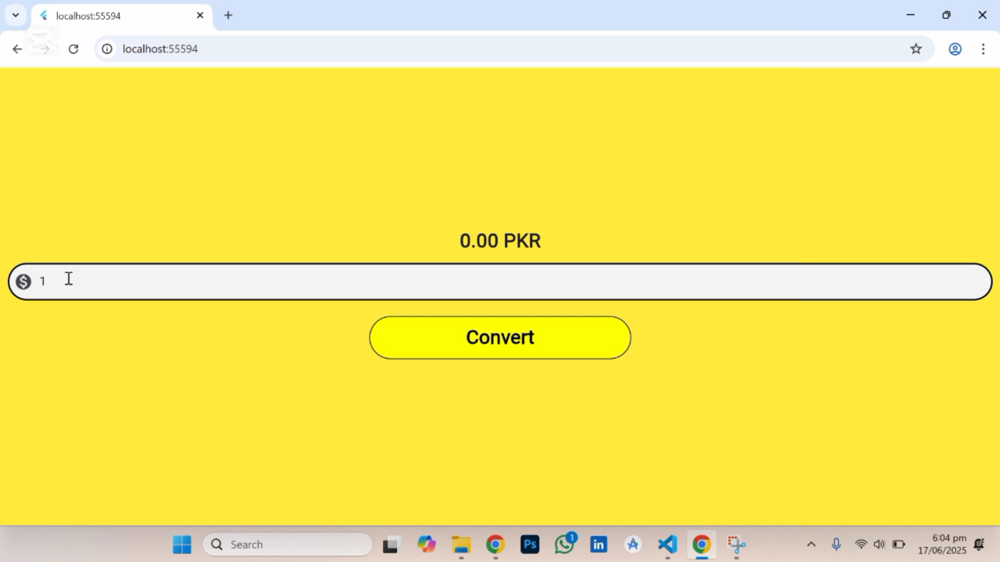
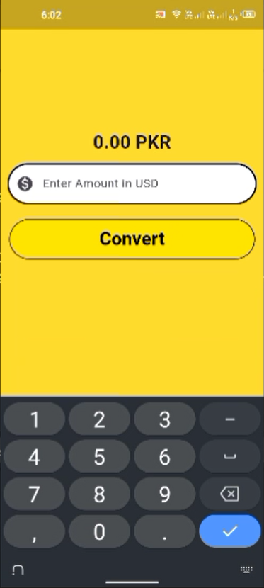

# currency_converter

This is my First Flutter Project. A simple Currency Converter App that contains of a single screen a button and a text field. it takes input from user in dollar and convert it into PKR.
Desktop Look:

Android Look:

## Getting Started

This project is a starting point for a Flutter application.

A few resources to get you started if this is your first Flutter project:

- [Lab: Write your first Flutter app](https://docs.flutter.dev/get-started/codelab)
- [Cookbook: Useful Flutter samples](https://docs.flutter.dev/cookbook)

For help getting started with Flutter development, view the
[online documentation](https://docs.flutter.dev/), which offers tutorials,
samples, guidance on mobile development, and a full API reference.
